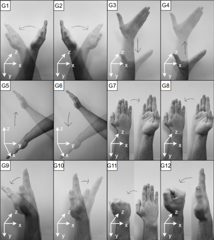

# Gesture Recognition Based on LSTM (Long Short-Term Memory Neural Network)
reading this in [简体中文](./README_ZH.md)
## Dataset Description

The dataset for this project is sourced from [HAND GESTURES RECORDED WITH MM-WAVE FMCW RADAR (AWR1642)](https://ieee-dataport.org/open-access/hand-gestures-recorded-mm-wave-fmcw-radar-awr1642).

### Illustration



The dataset contains 4600 samples, covering 12 different hand gesture movements. The data was collected by four different individuals using the FMCW AWR1642 radar. Each sample is saved as a CSV file and associated with the corresponding gesture type.

### Gesture Descriptions
- (G1) Arm Swing Left – A complete arm swing from right to left.
- (G2) Arm Swing Right – A complete arm swing from left to right.
- (G3) Hand Away – Hand moving away from the radar.
- (G4) Hand Towards – Hand moving towards the radar.
- (G5) Arm Up – Arm movement from down to up.
- (G6) Arm Down – Arm movement from up to down.
- (G7) Palm Up – Rotating the palm upwards.
- (G8) Palm Down – Rotating the palm downwards.
- (G9) Hand Left – Hand moving left (without arm movement).
- (G10) Hand Right – Hand moving right.
- (G11) Horizontal Fist – Making a fist horizontally.
- (G12) Vertical Fist – Making a fist vertically.

## Directory Structure

```
.
├── DataProcessed.py  Contains classes and methods related to data preprocessing, responsible for reading and preprocessing the dataset.
├── Neural_Networks.py  Contains neural network model definitions, training, evaluation, and visualization methods for classification tasks.
├── main.py  The main program, used to load the model and evaluate its accuracy on test data.
└── requirements.txt  List of Python libraries required for the project.
└── assets  Stores generated images.
└── model.pth  Pre-trained model file.
└── ConstantDefinition.py  Stores network training parameters, which can affect the training effect when adjusted.
```

## Usage Instructions

### Dependency Versions

- `python3.10`
- `matplotlib==3.9.2`
- `numpy==2.1.3`
- `torch==2.5.1+cu124`

> Installing different versions of libraries may cause dependency errors, so it's best to create a virtual environment to download the dependencies.

### Installing Dependencies

Run the following command in the project root directory to install the required Python libraries:

```bash
pip install -r requirements.txt
```

> If your computer does not have CUDA installed, change `torch==2.5.1+cu124` to `torch==2.5.1` in `requirements.txt` to use CPU for training.

### Running the Project

The `model.pth` file is a pre-trained model provided by the author. You can directly run the following command to view the model's accuracy:

```bash
python main.py
```

### Output Results

- The model's accuracy on the test data will be printed in the console.
- The loss and accuracy change graphs will be saved in the `assets/` directory as `loss.png` and `accuracy.png`, respectively.
- The confusion matrix graph will be saved in the `assets/` directory with the file name `title.png`.

## References

- For more detailed information on data preprocessing, please refer to the `DataProcessed.py` file.
- For more detailed information on neural network model definition and training, please refer to the `Neural_Networks.py` file.
- For more detailed information on the main program, please refer to the `main.py` file.